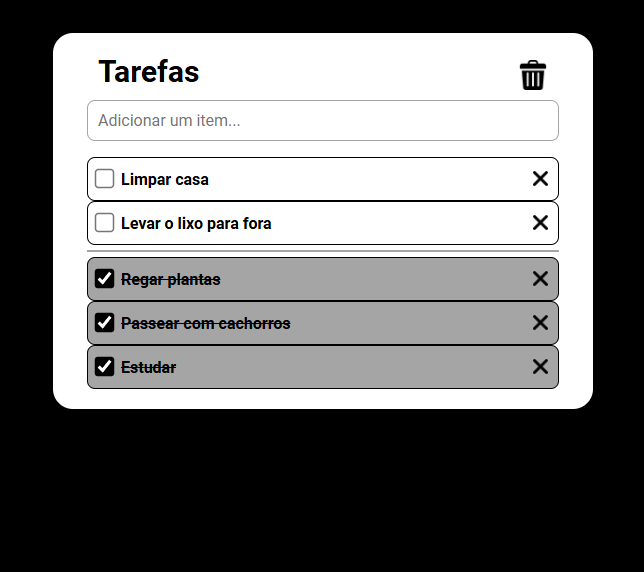

# Lista de tarefas

> Um aplicativo para gerenciar tarefas pendentes.

### Ajustes e melhorias

O projeto ainda está em desenvolvimento e as próximas atualizações serão voltadas para as seguintes tarefas:

- [x] Criar base do projeto
- [x] HTML
- [x] CSS 
- [x] Javascript - Funcionalidades basicas como criar e excluir tarefas e mudanças de estilo dinamicas
- [ ] Javascript - Login
- [ ] Javascript - Persistencia
- [ ] Deploy em produção

## ☕ Usando a lista de tarefas

Para adicionar tarefas basta digitar o nome da tarefa no campo superior e pressionar enter.
Para excluir 1 tarefa especifica basta pressionar o X a direita, e caso queira apagar todas as tarefas basta pressionar na lixeira.

## 👨‍💻 Desenvolvido por:

<table>
  <tr>
    <td align="center">
      <a href="https://www.linkedin.com/in/samuelmachadoduarte/" title="Meu linkedin">
         
        
          <b>Samuel Machado</b>
        
      </a>
    </td>
  </tr>
</table>

### 😄 Estou aberto a comentarios, dicas e criticas sobre o projeto! Sempre a disposição para aprender mais sobre o que poderia ser melhor.
